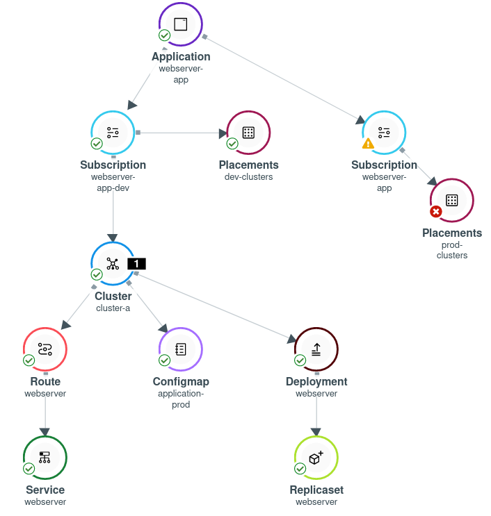
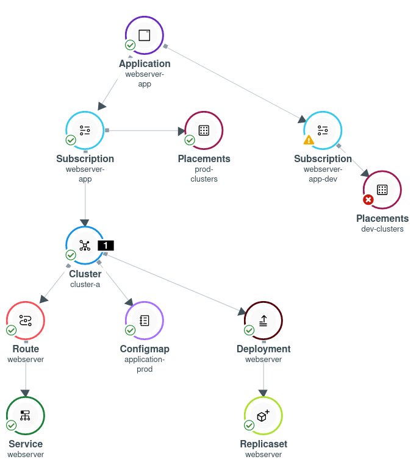

# Exercise 3 - Application Lifecycle

In this exercise you will deploy a demo application onto the managed cluster using Red Hat Advanced Cluster Management for Kubernetes. You will manage the application versions and use cluster labels to configure placement mechanisms.

In this exercise you will try to deploy an application that manages two versions -

* Development - [https://github.com/michaelkotelnikov/rhacm-workshop/tree/dev/03.Application_Lifecycle/exercise-application/application-resources](https://github.com/michaelkotelnikov/rhacm-workshop/tree/dev/03.Application_Lifecycle/exercise-application/application-resources)
* Production - [https://github.com/michaelkotelnikov/rhacm-workshop/tree/master/03.Application_Lifecycle/exercise-application/application-resources](https://github.com/michaelkotelnikov/rhacm-workshop/tree/master/03.Application_Lifecycle/exercise-application/application-resources)

Both versions of the application are stored in the same Git repository, while the **production** version is stored in the **master** branch, and the **development** version is stored in the **dev** branch.

The Application is a simple web application that provides a different output in each version. The **development** application will provide a web page, while the **production** application will provide a different web page.

Each version of the application will run on a cluster with the relevant tag. The application with the **development** version will run on clusters with the **environment=dev** label, while the application with the **production** version will run on clusters with the **environment=production** label. 

To achieve a functioning application create the next resources -

* **Namespace** - Create a namespace in which the custom resources are going to be deployed on the hub.

```
<hub> $ cat >> namespace.yaml << EOF
---
apiVersion: v1
kind: Namespace
metadata:
  name: webserver-acm
EOF

<hub> $ oc apply -f namespace.yaml
```


* **Channel** - Create a channel that refers to the GitHub repository in which the application’s resources are placed. The GitHub repository is at - [https://github.com/michaelkotelnikov/rhacm-workshop.git](https://github.com/michaelkotelnikov/rhacm-workshop.git)

```
<hub> $ cat >> channel.yaml << EOF
---
apiVersion: apps.open-cluster-management.io/v1
kind: Channel
metadata:
  name: webserver-app
  namespace: webserver-acm
spec:
  type: Git
  pathname: https://github.com/michaelkotelnikov/rhacm-workshop.git
EOF

<hub> $ oc apply -f channel.yaml
```


* **PlacementRule** - Create a PlacementRule that aggregates all clusters with the **environment=dev** label. This PlacementRule will be used to group all clusters that will run the development version of the application.

```
<hub> $ cat >> placementrule-dev.yaml << EOF
---
apiVersion: apps.open-cluster-management.io/v1
kind: PlacementRule
metadata:
  name: dev-clusters
  namespace: webserver-acm
spec:
  clusterConditions:
    - type: ManagedClusterConditionAvailable
      status: "True"
  clusterSelector:
    matchLabels:
      environment: dev
EOF

<hub> $ oc apply -f placementrule-dev.yaml
```

* **Subscription** - Create a subscription that binds between the defined above **PlacementRule** and **Channel** resources. The subscription will point to the relevant path on which the application resources are present - _03.Application_Lifecycle/exercise-application/application-resources_. Furthermore, the Subscription will point to the **dev** branch, in order to deploy the development version of the application.

```
<hub> $ cat >> subscription-dev.yaml << EOF
---
apiVersion: apps.open-cluster-management.io/v1
kind: Subscription
metadata:
  name: webserver-app-dev
  namespace: webserver-acm
  labels:
    app: webserver-app
  annotations:
    apps.open-cluster-management.io/github-path: 03.Application_Lifecycle/exercise-application/application-resources
    apps.open-cluster-management.io/git-branch: dev
spec:
  channel: webserver-acm/webserver-app
  placement:
    placementRef:
      kind: PlacementRule
      name: dev-clusters
EOF

<hub> $ oc apply -f subscription-dev.yaml 
```

* **Application** - Create an Application resource to aggregate Subscription resources. The Application resource aggregates the Subscription resources by using labels. In this case, you will be using the label - **app: webserver-app**.

```
<hub> $ cat >> application.yaml << EOF
---
apiVersion: app.k8s.io/v1beta1
kind: Application
metadata:
  name: webserver-app
  namespace: webserver-acm
spec:
  componentKinds:
  - group: apps.open-cluster-management.io
    kind: Subscription
  descriptor: {}
  selector:
    matchExpressions:
    - key: app
      operator: In
      values:
      - webserver-app
EOF

<hub> $ oc apply -f application.yaml 
```

After the resources are created. In the RHACM portal, navigate to **Application Lifecycle** -> **&lt;application name>**. And make sure that the resources are created.

Click on the route resource, and navigate to the URL - **https://&lt;route-url>/application.html**.

Make sure that the application is running the **development version** on cluster-a. Login into cluster-a, and validate that the application runs there.

```
<managed cluster> $ oc login -u admin -p <password> https://api.cluster.2222.sandbox.opentlc.com:6443

<managed cluster> $ oc get pods -n webserver-acm
```

Now that you have the **Development** version of the application running, it’s time to deploy the **Production** version alongside the **Development** version. Create the next resources -

* **PlacementRule** - Create a PlacementRule that aggregates the **production** clusters using the **environment=production** label.

```
<hub> $ cat >> placementrule-production.yaml << EOF
---
apiVersion: apps.open-cluster-management.io/v1
kind: PlacementRule
metadata:
  name: prod-clusters
  namespace: webserver-acm
spec:
  clusterConditions:
    - type: ManagedClusterConditionAvailable
      status: "True"
  clusterSelector:
    matchLabels:
      environment: production
EOF

<hub> $ oc apply -f placementrule-production.yaml
```

*   **Subscription** - Create a Subscription that maps the newly created **PlacementRule** to the previously created **Channel**. The subscription uses the **master** branch in the **Channel** in order to run the **production** version of the application.

```
<hub> $ cat >> subscription-production.yaml << EOF
---
apiVersion: apps.open-cluster-management.io/v1
kind: Subscription
metadata:
  name: webserver-app-prod
  namespace: webserver-acm
  labels:
    app: webserver-app
  annotations:
    apps.open-cluster-management.io/github-path: 03.Application_Lifecycle/exercise-application/application-resources
spec:
  channel: webserver-acm/webserver-app
  placement:
    placementRef:
      kind: PlacementRule
      name: prod-clusters
EOF

<hub> $ oc apply -f subscription-production.yaml
```

After creating the resources,  navigate to **Application Lifecycle** -> **webserver-app**. Note that the newly created Subscription does not deploy any resource on any of the clusters since there are no clusters with the **environment=production** label.



In order to deploy the production application on **cluster-a** -

*   navigate to **Cluster Lifecycle** -> **cluster-a** -> **Actions** -> **Edit labels**.
*   Remove the **environment=dev** label.
*   Add the **environment=production** label.

Wait for about 2 minutes for the application to redeploy on **cluster-a**, and navigate to **Application Lifecycle** -> **webserver-app**.

Note that the application is now deployed at its “production” version on **cluster-a**.



Click on the application’s route resource, and navigate to **https://&lt;route-url>/application.html**. The application now serves a different webpage, indicating that the application is in a production state.

**NOTE:** All of the resources you have configured in this exercise are present in the [git repository](https://github.com/michaelkotelnikov/rhacm-workshop.git). The resources can be created by running the next command -

```
<hub> $ oc apply -f https://raw.githubusercontent.com/michaelkotelnikov/rhacm-workshop/master/03.Application_Lifecycle/exercise-application/rhacm-resources/application.yaml
```
