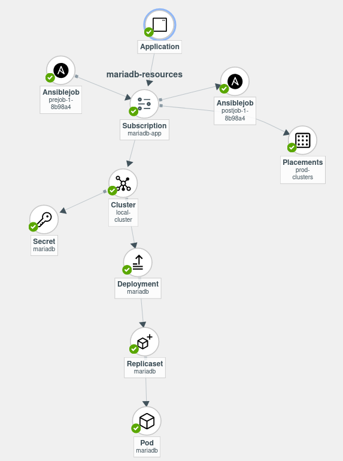
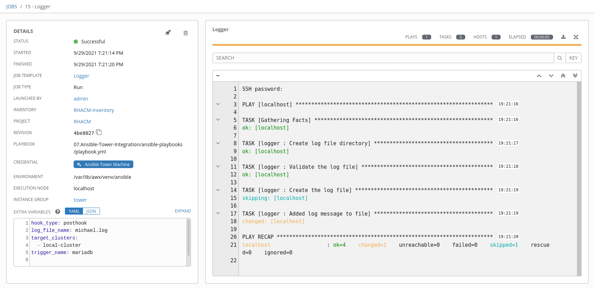

# Exercise 7 - Ansible Tower Integration

In this exercise you will go through Ansible Tower integration with Red Hat Advanced Cluster Management for Kubernetes. You will associate AnsibleJob hooks for applications and integrate AnsibleJobs with policy violations. Ansible Tower has already been configured for your use by the instructor, you will only configure Red Hat Advanced Cluster Management for Kubernetes.

The instructor will provide you with -

* Ansible Tower URL
* Ansible Tower web UI username / password
* Ansible Tower Access Token for API requests

## Before You Begin

In this section you will create the basic integration between RHACM and Ansible Tower. The integration is based on `Ansible Automation Platform Resource Operator`. Make sure to install the operator before you begin the next exercises. Installing the operator can be done by running the next commands on the hub cluster -

```
<hub> $ oc create namespace ansible-resource-operator

<hub> $ cat >> ansible-operator.yaml << EOF
---
apiVersion: operators.coreos.com/v1alpha1
kind: Subscription
metadata:
  name: awx-resource-operator
  namespace: ansible-resource-operator
spec:
  channel: release-0.1
  installPlanApproval: Automatic
  name: awx-resource-operator
  source: redhat-operators
  sourceNamespace: openshift-marketplace
  startingCSV: awx-resource-operator.v0.1.1
EOF

<hub> $ oc apply -f ansible-operator.yaml
```

The operator will now begin the installation process.

## Ansible Tower Application Integration

In this section, you will configure Ansible Tower Jobs to run as your RHACM Application deploys. The first job will run as a _prehook_ while the second job will run as a _posthook_.

Both Ansible Jobs will initiate the same Job Template on Ansible Tower called _Logger_. The _Logger_ Job Template logs each running instance of an Ansible Job to a file on the Ansible Tower server. Afterwards, the _Logger_ Job Template will expose the log files on a local web server on Ansible Tower. The participants can view all log files on the Ansible Tower server by navigating to the URL provided by the instructor in **port 80**.

### Setting up Authentication

In order to allow RHACM to access Ansible Tower you must set up a Namespace scoped secret for RHACM to use. The secret will contain the Ansible Tower URL and Access Token.

Before creating the secret itself, make sure that a namespace that will populate the secret exists -

```
<hub> $ oc create namespace mariadb
```

To create the secret, navigate to **Credentials** -> **Red Hat Ansible Automation Platform** in the RHACM UI and fill the next fields -

- Credentials name: **ansible-tower**
- Namespace: **mariadb**

Press **Next**.

At the next screen, specify the **Ansible Tower host** and **Ansible Tower token** provided by the instructor.

Press **Next**. Review the information, and press on **Add**.

### Setting up the Application

Before you continue, create a fork of the next GitHub repository - [https://github.com/michaelkotelnikov/rhacm-workshop](https://github.com/michaelkotelnikov/rhacm-workshop). As a result, you will have your own version of the repository - [https://github.com/&lt;your-username>/rhacm-workshop](https://github.com/michaelkotelnikov/rhacm-workshop).

Change the `log_file_name` variable value from `rhacm.log` to `<your-name>.log` in the [prehook](demo-application/mariadb-resources/prehook/pre_log.yaml) and [posthook](demo-application/mariadb-resources/posthook/post_log.yaml) definition in **your fork** of the repository.

Change the `pathname` definition in the Channel resource in the [application.yml](demo-application/rhacm-resources/application.yml) file in **your fork** of the repository. Change the `pathname` value from `https://github.com/michaelkotelnikov/rhacm-workshop.git` to `https://github.com/<your-username>/rhacm-workshop.git`

Apply the application resources from **your fork** -

```
<hub> $ oc apply -f https://raw.githubusercontent.com/<your-username>/rhacm-workshop/master/07.Ansible-Tower-Integration/demo-application/rhacm-resources/application.yml
```

Navigate to **Applications** -> **mariadb-app** in RHACM's UI. Note that the application has been deployed successfully alongside its pre and post hooks.



If you navigate to `http://<ansible-tower-url>/logs/<your-name>.log` you will notice the output of the Logger Ansible Job Template.

```
Wed Sep 29 16:20:27 UTC 2021 Ansible Job was triggered by mariadb as prehook in clusters ['local-cluster'].
Wed Sep 29 16:21:19 UTC 2021 Ansible Job was triggered by mariadb as posthook in clusters ['local-cluster'].
```

Note that the posthook executed ~1 min after the prehook.

Run the next commands to see more information about the executed AnsibleJobs. Each AnsibleJob instance has valubale information for troubleshooting and diagnostics -

```
<hub> $ oc get ansiblejob -n mariadb

NAME               AGE
postjob-1-4be802   13m
prejob-1-4be802    15m

<hub> $ oc describe ansiblejob prejob-1-4be802 -n mariadb

Name:         prejob-1-4be802
Namespace:    mariadb
Labels:       tower_job_id=13
Annotations:  apps.open-cluster-management.io/hook-type: prehook
              apps.open-cluster-management.io/hosting-subscription: mariadb/mariadb-app
API Version:  tower.ansible.com/v1alpha1
Kind:         AnsibleJob
Metadata:
    Manager:    OpenAPI-Generator
    Operation:  Update
    Time:       2021-09-29T16:20:30Z
  Owner References:
    API Version:     apps.open-cluster-management.io/v1
    Kind:            Subscription
    Name:            mariadb-app
    UID:             d5207886-dc95-4668-a96c-d7cc6468e079
  Resource Version:  513833
  UID:               0314f132-3495-4328-b84c-2d6815d25f5e
Spec:
  extra_vars:
    hook_type:      prehook
    log_file_name:  michael.log
    target_clusters:
      local-cluster
    trigger_name:     mariadb
  job_template_name:  Logger
  tower_auth_secret:  ansible-tower
Status:
  Ansible Job Result:
    Changed:   true
    Elapsed:   6.197
    Failed:    false
    Finished:  2021-09-29T16:20:28.465789Z
    Started:   2021-09-29T16:20:22.268481Z
    Status:    successful
    URL:       https://student1.a32d.example.opentlc.com/#/jobs/playbook/13
  Conditions:
    Ansible Result:
      Changed:             0
      Completion:          2021-09-29T16:20:37.920281
      Failures:            0
      Ok:                  3
      Skipped:             0
    Last Transition Time:  2021-09-29T16:19:08Z
    Message:               Awaiting next reconciliation
    Reason:                Successful
    Status:                True
    Type:                  Running
  k8sJob:
    Created:  true
    Env:
      Secret Namespaced Name:  mariadb/ansible-tower
      Template Name:           Logger
      Verify SSL:              false
    Message:                   Monitor the job.batch status for more details with the following commands:
'kubectl -n mariadb get job.batch/prejob-1-4be802'
'kubectl -n mariadb describe job.batch/prejob-1-4be802'
'kubectl -n mariadb logs -f job.batch/prejob-1-4be802'
    Namespaced Name:  mariadb/prejob-1-4be802
  Message:            This job instance is already running or has reached its end state.
Events:               <none>
```

More information can be found in the Ansible Tower UI. Log into the Ansible Tower UI using the URL and credentials provided by the instructor.

At the main dashboard, take a look at the **Recent Job Runs**. Press on the `Logger` Job Run that matches your timestamp.


